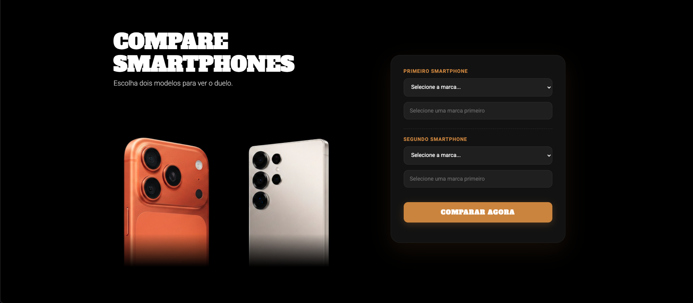

# Comparador de Celulares

Site desenvolvido para comparação de smartphones.

## Sobre o projeto
Este projeto é um site web criado com HTML, CSS e JavaScript, focado em apresentar informações organizadas e comparações entre modelos de celulares Samsung.

## 🛠 Tecnologias utilizadas
- HTML5
- CSS3
- JavaScript

## Acesse o site aqui

👉 https://querenbyte.github.io/Comparador-OFICIAL/comparar.html

## Uma Preview

